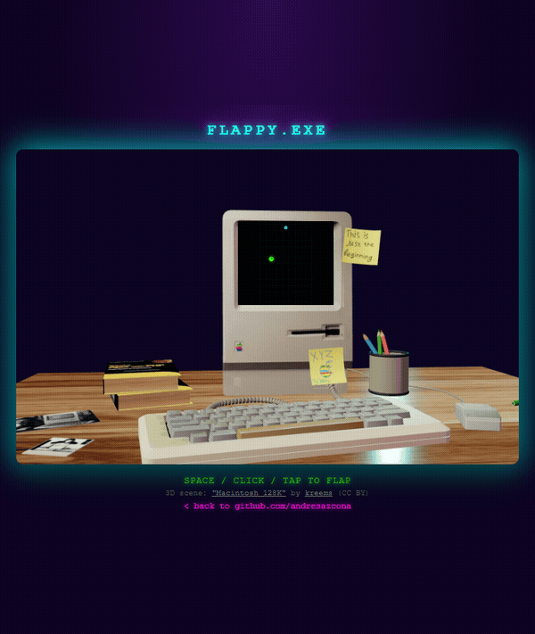

<div align="center">


[](https://git.io/typing-svg)


[](https://andresazcona.github.io/flappy-bird.html)
<br><sub>👆 real gameplay — click to actually play it</sub>

</div>

<br>

```bash
guest@andresazcona:~$ whoami
> Andres Azcona — Software Architect focused on Cloud & Infrastructure
> Building resilient, reproducible systems: DevOps, embedded & backend
> Stack: AWS · Docker · Linux · CI/CD · Node.js · Python · TypeScript
> Philosophy: boring, reproducible infra beats clever, fragile infra
```

<br>

<div align="center">

### ⚡ STACK


</div>

<br>

## 🛰️ FEATURED PROJECTS

<table>
<tr>
<td width="50%">

**[🌐 IP-Tracker](https://github.com/andresazcona/IP-Tracker)**
Sistema de monitoreo y gestión de dispositivos IP con auth JWT, roles, tracking en tiempo real y arquitectura Docker — pensado para Raspberry Pi / IoT.
`JavaScript` `Docker` `JWT` `IoT`

</td>
<td width="50%">

**[🏗️ architecture-comparison](https://github.com/andresazcona/architecture-comparison)**
Estudio comparativo monolito vs microservicios sobre un e-commerce, con pruebas de carga en k6 midiendo throughput, latencia y resiliencia.
`Node.js` `k6` `Microservices`

</td>
</tr>
<tr>
<td width="50%">

**[🩺 HealthLeap](https://github.com/andresazcona/HealthLeap-MONOLITH)**
API REST para gestión médica (citas, médicos, pacientes). Node.js + Express + TypeScript + PostgreSQL, con JWT, Docker y CI/CD automatizado.
`TypeScript` `PostgreSQL` `CI/CD`

</td>
<td width="50%">

**[🗄️ SQLhelper](https://github.com/andresazcona/SQLhelper)**
Parser de DDL SQL que genera diagramas entidad-relación en Mermaid a partir de MySQL, PostgreSQL, SQLite, SQL Server u Oracle.
`TypeScript` `Full-stack`

</td>
</tr>
</table>

<br>

<div align="center">

### 📡 GITHUB STATS


</div>

<br>

<div align="center">

### 🔗 CONNECT

<a href="https://github.com/andresazcona" target="_blank"></a>
<a href="https://linkedin.com/in/andresazcona" target="_blank"></a>


</div>
