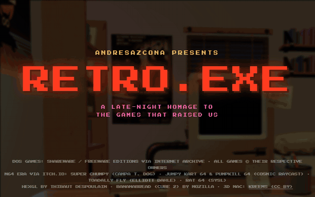
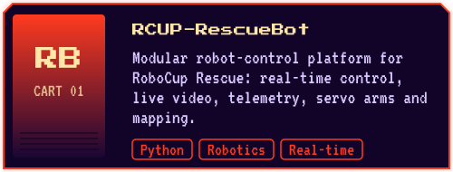
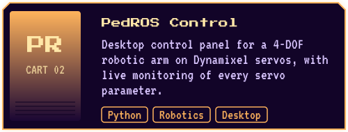
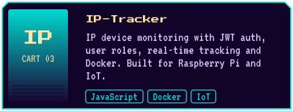
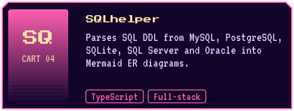
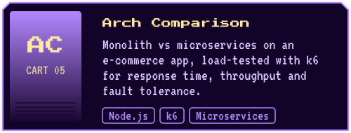
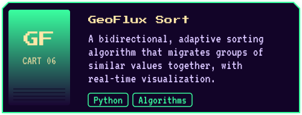

  

 



<a href="https://andresazcona.github.io/"></a>

<b>click to boot OS 97</b> · DOOM · Wolfenstein 3D · Heretic · Commander Keen · Jumpy Kart 64 · HexGL · +9 more

 



INFRA 

CODE 

HARDWARE 

 



<a href="https://github.com/andresazcona/RCUP-RescueBot"></a>
<a href="https://github.com/andresazcona/PedROS-ControlPanel"></a>
<a href="https://github.com/andresazcona/IP-Tracker"></a>
<a href="https://github.com/andresazcona/SQLhelper"></a>
<a href="https://github.com/andresazcona/architecture-comparison"></a>
<a href="https://github.com/andresazcona/geoflux_sorter_project"></a>

 



 





